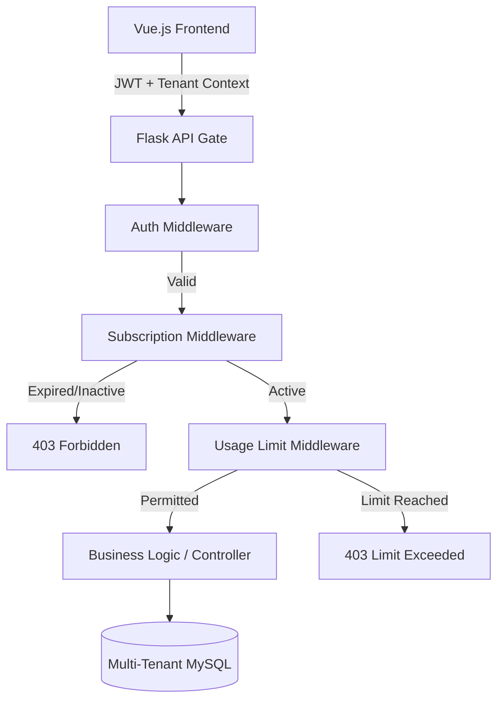
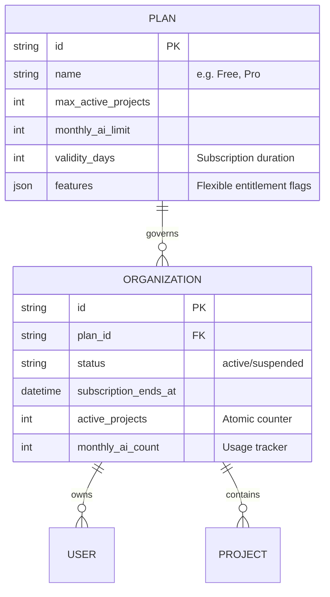

# ThesisVault SaaS: Subscription & Entitlement Architecture

This document outlines the multi-tenant architecture and subscription enforcement strategies used in ThesisVault to satisfy the **SaaS Feature Entitlement** requirements.

## 1. System Architecture
ThesisVault utilizes a **Shared Database, Isolated Schemas (Logical Isolation)** approach. Every table includes an `organization_id` to ensure strict tenant boundaries.

### Tenant Isolation Strategy
- **Logical Separation**: Every query is automatically scoped by `organization_id`.
- **API validation**: A global `before_flush` hook in `events.py` validates that submissions cannot be cross-linked between organizations, preventing "ID scanning" attacks.

## 2. Database Schema (Subscription focus)
The system uses a data-driven model where plans define the capabilities and limits of an organization.

## 3. Entitlement Flow (API Level)
Access to premium features (like AI Analysis) is determined at the API level through three specialized decorators in `decorators.py`:

1.  **`@subscription_required`**: Checks if the organization is active, hasn't expired, or is within its grace period.
2.  **`@requires_feature(name)`**: Checks both explicit columns and the `features` JSON map on the Plan. This allows adding new features (e.g., "Advanced PDF Exports") without schema changes.
3.  **`@limit_check`**: Compares the organization's atomic counters (e.g., `active_projects`) against the plan's defined limits.

## 4. Preventing Race Conditions
Usage limits (like project counts) are handled using **SQL-level Atomic Increments**. 

Instead of:
`org.active_projects = org.active_projects + 1` (Prone to race conditions)

ThesisVault uses:
`UPDATE organizations SET active_projects = active_projects + 1 WHERE id = :org_id`

This ensures that even if 100 students join projects simultaneously, the count remains 100% accurate without expensive row-level locks.

## 5. Subscription Lifecycle
The system handles the entire lifecycle:
- **Active**: Full access as per plan.
- **Expired**: Blocked at API level via `is_subscription_valid`.
- **Grace Period**: Temporary access beyond expiry date.
- **Maintenance**: An organization-wide "Kill Switch" (`is_maintenance`) for technical emergencies.

## 6. Auditability & Traceability
To satisfy modern compliance standards (Requirement 2 & 3), ThesisVault maintains a permanent record of all administrative subscription actions:
- **Plan History**: Every upgrade, downgrade, or initial signup is logged in the `SubscriptionHistory` table with timestamps and reasons.
- **Activity Logs**: All project deletions, user onboarding beyond limits, or plan changes create an immutable `ActivityLog` entry.
- **Audit API**: A secure administrator-only endpoint (`/api/admin/organizations/me/history`) provides full transparency into these events, ensuring a clear audit trail for compliance reviews.
